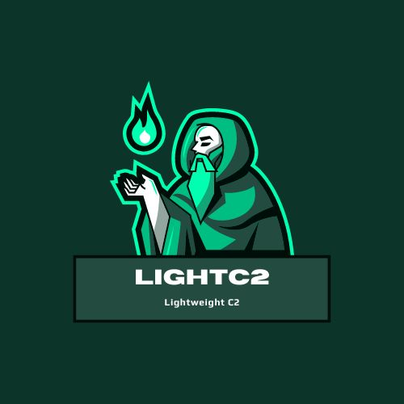

<div align="center">
  

  <p><i>Lightweight Adversary simulation command and control platform created by <a href="https://twitter.com/PPh3nX">@PPh3nX</a></i></p>
</div>

---------------------------------------------------------------------------------------------------------------------------------

## Overview

LightC2 is an modulable lightweight Adversary simulation command and control platform. It includes modules execution, cli interface, web api, custom agents/shellcodes, custom methods ...

This platform is destinated to cybersecurity experts for pentest/red team operations purposes.

## Usage

Global usage:

```py
usage: LightC2 [-h] [--password PASSWORD] [--user USER] [--register] [--register-key REGISTER_KEY] [--teamserver TEAMSERVER] mode

Minimalist C2 for short offensive missions

positional arguments:
  mode                  Specify if the script is in server mode (teamserver), or in client mode

options:
  -h, --help            show this help message and exit
  --password PASSWORD, -p PASSWORD
                        Specify a password for client mode
  --user USER, -u USER  Specify a user for client mode
  --register, -r        If set, will register the user you passed in argument (need the register key)
  --register-key REGISTER_KEY, -k REGISTER_KEY
                        Specify the key to register to team server in client mode
  --teamserver TEAMSERVER, -t TEAMSERVER
                        Specify the host (https://host:port) to connect to the team server in client mode
```
Server side example:

```sh
python3 main.py server
```

Client side example:

```sh
python3 main.py client -u user -p password --teamserver https://127.0.0.1:8080
```
